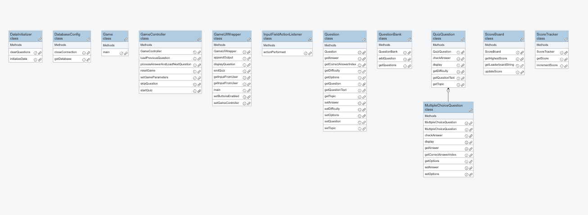

# Welcome to the Learning Outcomes Evaluation

Dear students,

Welcome to this Learning Outcomes Evaluation session. The goal is to assess your understanding and mastery of the learning outcomes for this semester as evidenced by your work that was submitted on your personal git account. Remember to answer each question thoroughly by referencing **Java** code and provide clear explanations where necessary.

Best regards,
Kay Berkling

## Ethics Section regarding generative and other forms of AI

The student acknowledges and agrees that the use of AI is strictly prohibited during this evaluation. By submitting this report, the student affirms that they have completed the form independently and without the assistance of any AI technologies. This agreement serves to ensure the integrity and authenticity of the students work, as well as their understanding of the learning outcomes.

## Checklist before handing in your work

* [x] Review the assignment requirements to ensure you have completed all the necessary tasks.
* [x] Double-check your links and make sure that links lead to where you intended. Each answer should have links to work done by you in your own git repository. (Exception is Speed Coding)
* [x] Make sure you have at least 10 references to your project code (This is important evidence to prove that your project is substantial enough to support the learning outcome of object oriented design and coding within a larger piece of code.)
* [x] Include comments to explain your referenced code and why it supports the learning outcome.
* [x] Commit and push this markup file to your personal git repository and hand in the link and a soft-copy via email at the end of the designated time period.

Remember, this checklist is not exhaustive, but it should help you ensure that your work is complete, well-structured, and meets the required standards.

Good luck with your evaluation!

# Project Description (70%)

## Link
My [Java Project](https://github.com/Obrienmaina-Mosbach/Quiz-Game-The-Second-Coming/tree/68c0169723deb7122b7d235c28a530e890acb22c)  link

## TECH STACK

Java Swing
MongoDB
JAVA

## What did you achieve? 

I managed to create an interactive game with a UI and a Database

## Learning Outcomes

| Exam Question | Total Achievable Points | Points Reached During Grading |
|---------------|------------------------|-------------------------------|
| Q1. Algorithms    |           4            |                               |
| Q2.Data types    |           4            |                               |
| Q3.Complex Data Structures |  4            |                               |
| Q4.Concepts of OOP |          6            |                               |
| Q5.OO Design     |           6            |                               |
| Q6.Testing       |           3            |                               |
| Q7.Operator/Method Overloading | 6 |                               |
| Q8.Templates/Generics |       4            |                               |
| Q9.Class libraries |          4            |                               |

## Evaluation Questions

Please answer the following questions to the best of your ability to show your understanding of the learning outcomes. Please provide examples from your project code to support your answers.

## Evaluation Material

### Q1. Algorithms

Algorithms are manyfold and Java can be used to program these. Examples are sorting or search strategies but also mathematical calculations. Please refer to **two** areas in either your regular coding practice (for example from Semester 1) or within your project, where you have coded an algorithm. Do not make reference to code written for other classes, like theoretical informatics.

*your text*

| Total Achievable Points | Points Reached During Grading |
|------------------------|-------------------------------|
|                        |                               |
|           4            |                               |

### Q2. Data types

Please explain the concept of data types and provide examples of different data types in Java.
typical data types in java are int, double, float, char, boolean, long, short, byte, String, and arrays. Please provide one example for each of the **four** following data types in your code.
* arrays
* Strings
* boolean
* your choice

>Here is a link for [Strings](https://github.com/Obrienmaina-Mosbach/Quiz-Game-The-Second-Coming/blob/4c6a952bf0e59fa48d543dc70077c01a1c25fb80/src/main/java/brian/dhbw/project/gradle/QuestionBank.java#L16) I have used   
>Here is a link for [int](https://github.com/Obrienmaina-Mosbach/Quiz-Game-The-Second-Coming/blob/4c6a952bf0e59fa48d543dc70077c01a1c25fb80/src/main/java/brian/dhbw/project/gradle/GameController.java#L176)I have used  
>Here is a link for [boolean](https://github.com/Obrienmaina-Mosbach/Quiz-Game-The-Second-Coming/blob/4c6a952bf0e59fa48d543dc70077c01a1c25fb80/src/main/java/brian/dhbw/project/gradle/GameController.java#L169) I have used  
>Here is a link for [array](https://github.com/Obrienmaina-Mosbach/Quiz-Game-The-Second-Coming/blob/4c6a952bf0e59fa48d543dc70077c01a1c25fb80/src/main/java/brian/dhbw/project/gradle/GameController.java#L20) I have used

| Total Achievable Points | Points Reached During Grading |
|------------------------|-------------------------------|
|                        |                               |
|           4             |                               |

### Q3. Complex Data Structures

Examples of complex data structures in java are ArrayList, HashMap, HashSet, LinkedList, and TreeMap. Please provide an example of how you have used **two** of these complex data structures in your code and explain why you have chosen these data structures.

>Here is a link for [arrayLists](https://github.com/Obrienmaina-Mosbach/Quiz-Game-The-Second-Coming/blob/68c0169723deb7122b7d235c28a530e890acb22c/src/main/java/brian/dhbw/project/gradle/GameController.java#L54) I have used in my project  
>because they do not have a fixed size which is important for when the questions(per topic and level) are gathered they can vary in number.

| Total Achievable Points | Points Reached During Grading |
|------------------------|-------------------------------|
|                        |                               |
|           4             |                               |

### Q4. Concepts of OOP
Concepts of OOP are the basic building blocks of object-oriented programming, such as classes, objects, methods, and attributes. 
Explain HOW and WHY your **project** demonstrates the use of OOP by using all of the following concepts:
* Classes/Objects
* Methods
* Attributes 
Link to the code in your project that demonstrates what you have explained above.

>I have used an [QuizQuestion class](https://github.com/Obrienmaina-Mosbach/Quiz-Game-The-Second-Coming/blob/4c6a952bf0e59fa48d543dc70077c01a1c25fb80/src/main/java/brian/dhbw/project/gradle/QuizQuestion.java#L3)  
> which is used inherited by my [MultipleChoice Class](https://github.com/Obrienmaina-Mosbach/Quiz-Game-The-Second-Coming/blob/4c6a952bf0e59fa48d543dc70077c01a1c25fb80/src/main/java/brian/dhbw/project/gradle/MultipleChoiceQuestion.java#L9)  
> allowing me to make use of methods such as [getQuestionText](https://github.com/Obrienmaina-Mosbach/Quiz-Game-The-Second-Coming/blob/4c6a952bf0e59fa48d543dc70077c01a1c25fb80/src/main/java/brian/dhbw/project/gradle/MultipleChoiceQuestion.java#L41) 
> I have made use of [Object](https://github.com/Obrienmaina-Mosbach/Quiz-Game-The-Second-Coming/blob/68c0169723deb7122b7d235c28a530e890acb22c/src/main/java/brian/dhbw/project/gradle/MultipleChoiceQuestion.java#L17https://github.com/Obrienmaina-Mosbach/Quiz-Game-The-Second-Coming/blob/68c0169723deb7122b7d235c28a530e890acb22c/src/main/java/brian/dhbw/project/gradle/MultipleChoiceQuestion.java#L17) that are created from Constractor [Constructor](https://github.com/Obrienmaina-Mosbach/Quiz-Game-The-Second-Coming/blob/68c0169723deb7122b7d235c28a530e890acb22c/src/main/java/brian/dhbw/project/gradle/QuizQuestion.java#L3),  

| Total Achievable Points | Points Reached During Grading |
|------------------------|-------------------------------|
|                        |                               |
|             6           |                               |

### Q5. OO Design
Please showcase **two** areas where you have used object orientation and explain the advantage that object oriented code brings to the application or the problem that your code is addressing.
Examples in java of good oo design are encapsulation, inheritance, polymorphism, and abstraction. 

## Constructors
>Link 1 to [Constructor](https://github.com/Obrienmaina-Mosbach/Quiz-Game-The-Second-Coming/blob/68c0169723deb7122b7d235c28a530e890acb22c/src/main/java/brian/dhbw/project/gradle/ScoreTracker.java#L5)  
>Link 2 to [Constructor](https://github.com/Obrienmaina-Mosbach/Quiz-Game-The-Second-Coming/blob/68c0169723deb7122b7d235c28a530e890acb22c/src/main/java/brian/dhbw/project/gradle/QuizQuestion.java#L3)  
>Link 2 to [Constructor](https://github.com/Obrienmaina-Mosbach/Quiz-Game-The-Second-Coming/blob/68c0169723deb7122b7d235c28a530e890acb22c/src/main/java/brian/dhbw/project/gradle/MultipleChoiceQuestion.java#L9)

## Encapsulation
>Link 1 to [Encapsulation](https://github.com/Obrienmaina-Mosbach/Quiz-Game-The-Second-Coming/blob/68c0169723deb7122b7d235c28a530e890acb22c/src/main/java/brian/dhbw/project/gradle/ScoreTracker.java#L4)  
>Link 2 to [Encapsulation](https://github.com/Obrienmaina-Mosbach/Quiz-Game-The-Second-Coming/blob/68c0169723deb7122b7d235c28a530e890acb22c/src/main/java/brian/dhbw/project/gradle/DatabaseConfig.java#L17)

## Inheritance
>Link 1 to Inheritance [childClass](https://github.com/Obrienmaina-Mosbach/Quiz-Game-The-Second-Coming/blob/68c0169723deb7122b7d235c28a530e890acb22c/src/main/java/brian/dhbw/project/gradle/MultipleChoiceQuestion.java#L9)  extends from [Superclass](https://github.com/Obrienmaina-Mosbach/Quiz-Game-The-Second-Coming/blob/68c0169723deb7122b7d235c28a530e890acb22c/src/main/java/brian/dhbw/project/gradle/QuizQuestion.java#L3)

## Polymorphism
>Link 1 to Polymorphism [Line](https://github.com/Obrienmaina-Mosbach/Quiz-Game-The-Second-Coming/blob/68c0169723deb7122b7d235c28a530e890acb22c/src/main/java/brian/dhbw/project/gradle/GameController.java#L120)

## Abstraction
>Link 1 to [Abstraction](https://github.com/Obrienmaina-Mosbach/Quiz-Game-The-Second-Coming/blob/68c0169723deb7122b7d235c28a530e890acb22c/src/main/java/brian/dhbw/project/gradle/QuizQuestion.java#L3)  
>Link 2 to [Abstraction](https://github.com/Obrienmaina-Mosbach/Quiz-Game-The-Second-Coming/blob/68c0169723deb7122b7d235c28a530e890acb22c/src/main/java/brian/dhbw/project/gradle/QuizQuestion.java#L30)

>Object orientation allows me to have dry code that means I am able to reuse code without having to write redundant or repetitive code

| Total Achievable Points | Points Reached During Grading |
|------------------------|-------------------------------|
|                        |                               |
|              6          |                               |

### Q6. Testing
Java code is tested by using JUnit. Please explain how you have used JUnit in your project and provide a link to the code where you have used JUnit. Links do not have to refer to your project and can refer to your practice code. If you tested without JUnit, please explain how you tested your code.
Be detailed about what you are testing and how you argue for your test cases. 

Feel free to refer to the vibe coding session where you explored testing. (pair programming - you may link to your partner git and name him/her.)

Test cases usually cover the following areas:
* boundary cases
* normal cases
* error cases / catching exceptions 

*your text*

| Total Achievable Points | Points Reached During Grading |
|------------------------|-------------------------------|
|                        |                               |
|         3               |                               |

### Q7. Operator/Method Overloading
An example of operator overloading is the "+" operator that can be used to add two numbers or concatenate two strings. An example of method overloading is having two methods with the same name but different parameters. Please provide an example of how you have used operator or method overloading in your code and explain why you have chosen this method of coding.
The link does not have to be to your project and can be to your practice code.

*your text*

| Total Achievable Points | Points Reached During Grading |
|------------------------|-------------------------------|
|                        |                               |
|          6              |                               |

### Q8. Templates/Generics
Generics in java are used to create classes, interfaces, and methods that operate on objects of specified types. Please provide an example of how you have used generics in your code and explain why you have chosen to use generics. The link does not have to be to your project and can be to your practice code.

*your text*

| Total Achievable Points | Points Reached During Grading |
|------------------------|-------------------------------|
|                        |                               |
|           6             |                               |

### Q9. Class Libraries
Examples of class libraries in java are the Java Standard Library, JavaFX, Apache Commons, JUnit, Log4j, Jackson, Guava, Joda-Time, Hibernate, Spring, Maven, and many more. Please provide an example of how you have used a class library in your **project** code and explain why you have chosen to use this class library. 

>Here is a link for [Swing](https://github.com/Obrienmaina-Mosbach/Quiz-Game-The-Second-Coming/blob/4c6a952bf0e59fa48d543dc70077c01a1c25fb80/src/main/java/brian/dhbw/project/gradle/GameUIWrapper.java#L3) I have used  
> in my application to allow me apply ui elements enhancing my application.
> 

| Total Achievable Points | Points Reached During Grading |
|------------------------|-------------------------------|
|                        |                               |
|            6            |                               |

# Creativity (10%)
Which one did you choose: 

* [x] Web Interface with Design
* [x] Database Connected
* [ ] Multithreading
* [ ] File I/O
* [ ] API
* [ ] Deployment

>I used Swing for my [User Interface](https://github.com/Obrienmaina-Mosbach/Quiz-Game-The-Second-Coming/blob/4c6a952bf0e59fa48d543dc70077c01a1c25fb80/src/main/java/brian/dhbw/project/gradle/GameUIWrapper.java#L3) and MongoDB for my [database](https://github.com/Obrienmaina-Mosbach/Quiz-Game-The-Second-Coming/blob/4c6a952bf0e59fa48d543dc70077c01a1c25fb80/src/main/java/brian/dhbw/project/gradle/DatabaseConfig.java#L48)

| Total Achievable Points | Points Reached During Grading |
|------------------------|-------------------------------|
|                        |                               |
|            10          |                               |

# Speed Coding (20%)
Please enter **three** Links to your speed coding session GITs and name your partner. 

>Brian, and Daniel [GradeSystem](https://github.com/DanielMiuta24/JavaClass/tree/2e91866f2baa8a0e85bf4cc707e3e13e5afa57aa/Semester2/GradeSystem)  
>Brian, and Niki [CarRentalManager](https://github.com/Obrienmaina-Mosbach/CarRentalManager/tree/main/src)  
>Brian, Sahil and Joaquin [Inventory Management System](https://github.com/Obrienmaina-Mosbach/Bumble-Bee-The-Second-Coming/tree/main/InventoryManagementSystem)

Paste your class diagram for your project that you developed during the peer review class here: 

>Image from Peer Review for Class:

It can be done very simply by just copying any image and pasting it while editing Readme.md.

| Total Achievable Points | Points Reached During Grading |
|------------------------|-------------------------------|
|                        |                               |
|            16            |                               |

