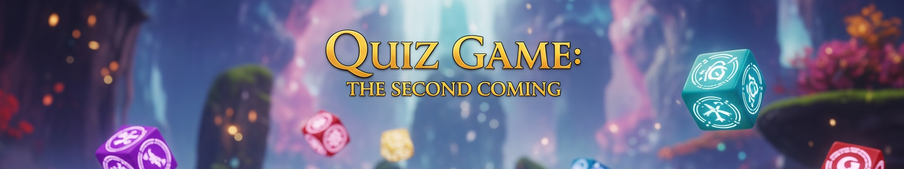

# Quiz Game



## Description
This is a Java-based quiz game v.2.0 where players can choose a topic and difficulty level, answer multiple-choice questions, and track their scores. The game includes a timer for each question and supports skipping or revisiting questions. Scores are saved and displayed on a leaderboard.

## Features
- Selectable quiz topics and difficulty levels
- Timed questions with configurable time limits
- Ability to skip or revisit questions
- Score tracking and leaderboard
- Questions loaded dynamically from JSON files

## Project Structure
```
brian.dhbw.project.gradle/
|-- Game.java              # Entry point of the game
|-- GameController.java    # Manages game flow and logic
|-- Question.java          # Represents a question with options and an answer
|-- QuestionBank.java      # Loads questions from JSON files
|-- ScoreTracker.java      # Manages the player's score
|-- ScoreBoard.java        # Manages high scores and leaderboard
|-- resources/             # JSON files containing quiz questions
```

## Installation & Setup
1. Clone this repository:
   ```sh
   git clone https://github.com/Obrienmaina-Mosbach/Quiz-Game-The-Second-Coming
   ```
2. Open the project in an IDE (e.g., IntelliJ IDEA, Eclipse, VS Code).
3. Ensure you have Java installed (JDK 11 or higher).
4. Run `Game.java` to start the game.

## Usage
1. Enter your name.
2. Select a quiz topic.
3. Choose a difficulty level.
4. Answer the questions within the time limit.
5. View your final score and leaderboard rankings.

## Technologies Used
- Java
- JSON (for storing questions and scores)
- Jackson library (for JSON parsing)

## Future Improvements
- Add more quiz topics and difficulty levels
- Implement a graphical user interface (GUI)
- Support multiplayer mode
- Save player progress

## Author
Brian Maina Nyawira

## License
This project is licensed under the MIT License.


